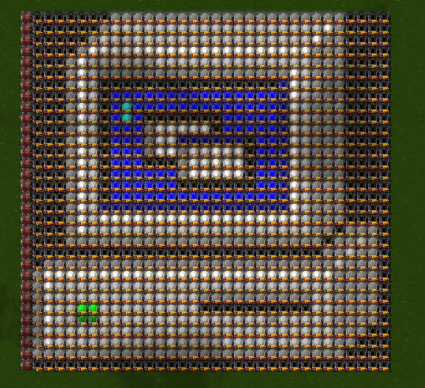

# Image to Factorio Blueprint Converter

A Python tool that converts images into Factorio blueprints, allowing you to recreate pictures in-game using colored lamps.

## 🛠️ Installation
1. **Clone this repository:**
```bash
git clone https://github.com/yourusername/factorio-image-converter.git
cd factorio-image-converter
```

### Windows
2. **Create virtual environment and install dependencies:**
```bash
python -m venv venv
pip install -r requirements.txt
```
3. **Run the script:**
```bash
python src/main.py
```
**Or**

Run the `run.bat`

### Linux
2. **Create virtual environment and install dependencies:**
```bash
python3 -m venv venv
pip install -r requirements.txt
```
3. **Run the script:**
```bash
python3 src/main.py
```
**Or**

Run the `run.sh`

## ⚡ Usage

1. Run the app and enter the path to your image (32x32 max)
2. Copy the blueprint string
3. Insert the string in to the game

## 🎉 Result
**Input image:**


**Output:**

